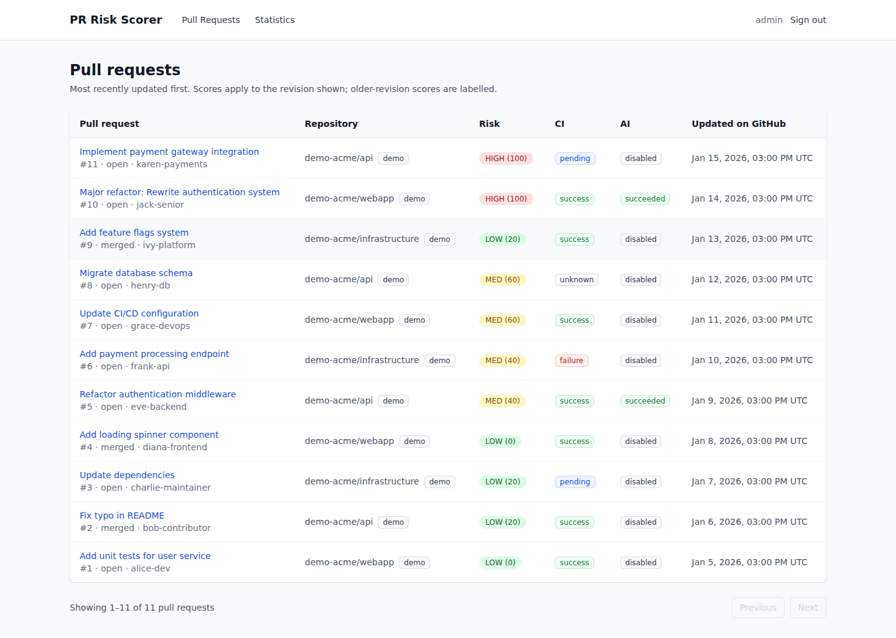
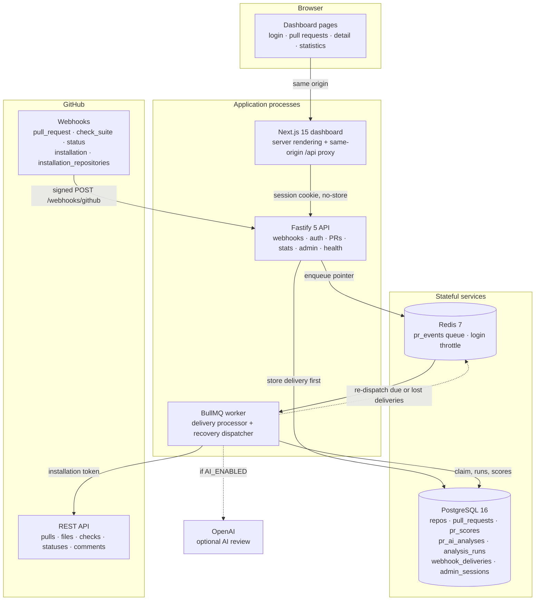
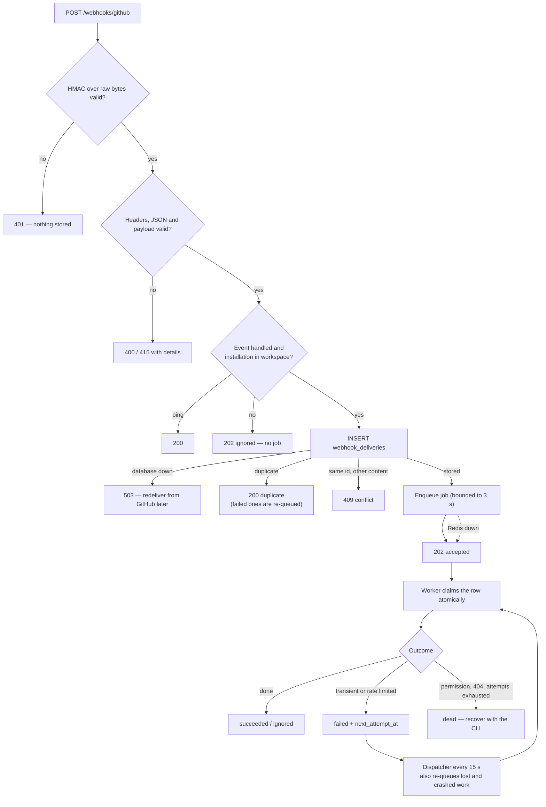
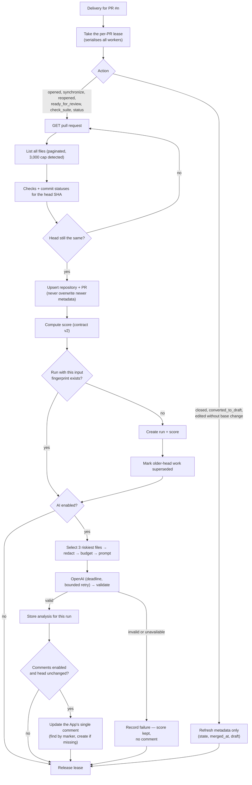
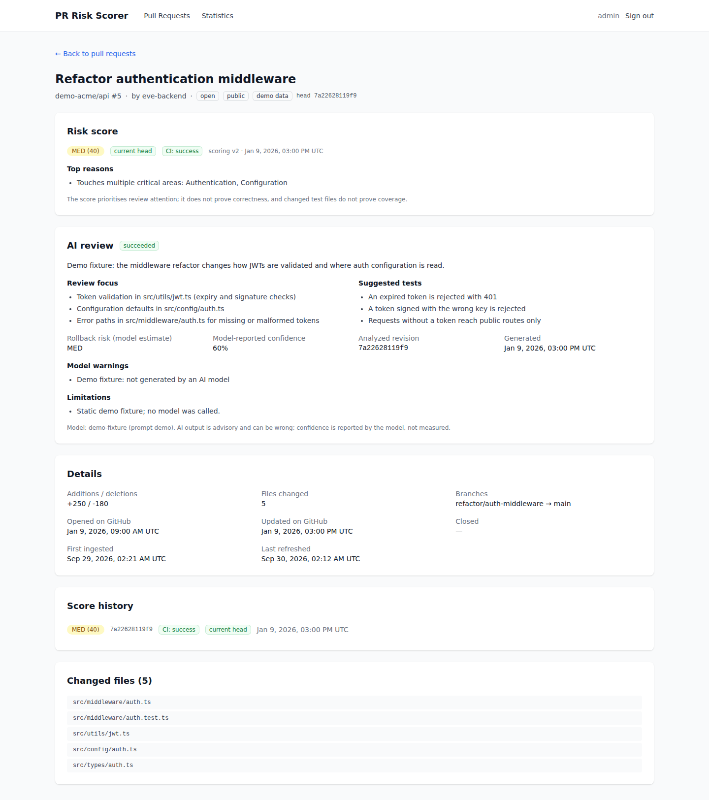
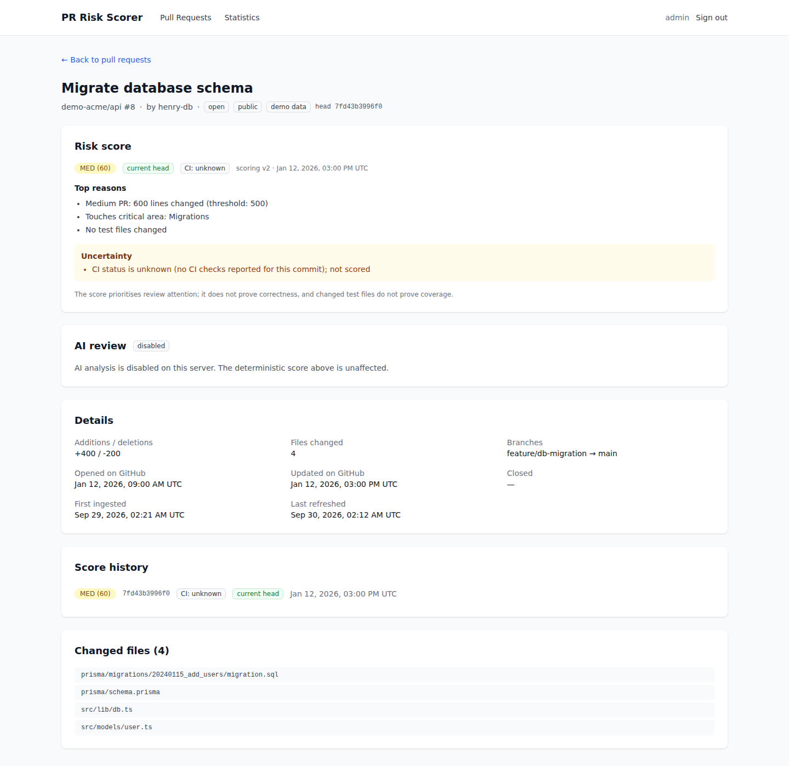
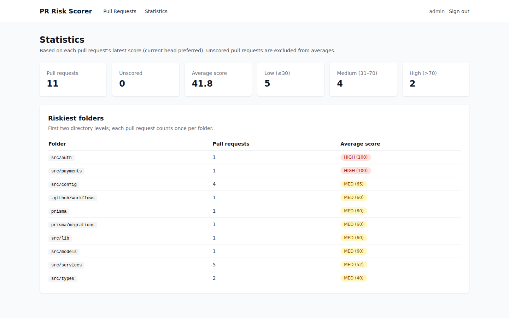
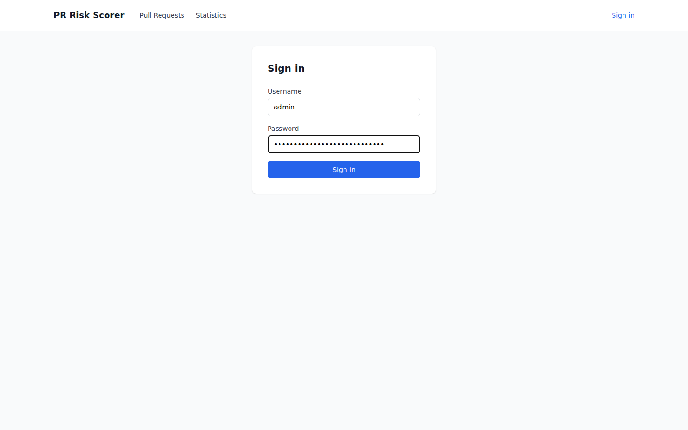
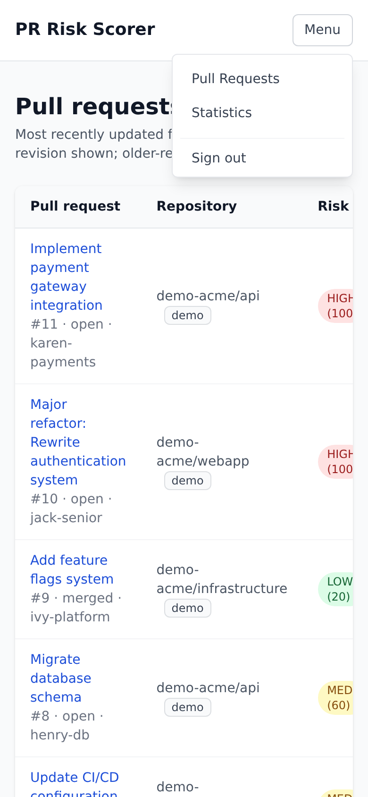

<div align="center">
  
</div>

# PR Risk Scorer - GitHub Pull Request Risk Analysis

A GitHub App and private dashboard that tells reviewers which pull requests deserve attention first.
For every pull request revision it receives GitHub's signed webhook, stores it durably, fetches the
complete list of changed files and the CI results for the exact head commit, and computes a
deterministic 0–100 risk score with its reasons. An optional AI review summarises the three
riskiest diffs, and an optional single comment keeps the pull request itself up to date.

Fastify 5 API · BullMQ worker on Redis · PostgreSQL 16 with Prisma · Next.js 15 dashboard ·
GitHub App authentication · optional OpenAI review.


[](https://github.com/AhmedKamal-41/pr-score-app/actions/workflows/ci.yml)

<p align="center">
  <a href="docs/screenshots/pull-requests.png">
    
  </a>
</p>

## Table of contents

- [Overview](#overview)
- [Key features](#key-features)
- [Engineering highlights](#engineering-highlights)
- [System architecture](#system-architecture)
- [Webhook delivery lifecycle](#webhook-delivery-lifecycle)
- [Pull request analysis pipeline](#pull-request-analysis-pipeline)
- [Scoring model](#scoring-model)
- [AI review pipeline](#ai-review-pipeline)
- [Technology stack](#technology-stack)
- [Security and privacy](#security-and-privacy)
- [Screenshots](#screenshots)
- [Testing strategy](#testing-strategy)
- [API reference](#api-reference)
- [Local setup](#local-setup)
- [Local infrastructure with Docker](#local-infrastructure-with-docker)
- [Environment variables](#environment-variables)
- [GitHub App setup](#github-app-setup)
- [Deployment](#deployment)
- [Operations and recovery](#operations-and-recovery)
- [Project structure](#project-structure)
- [Known limitations](#known-limitations)
- [Future improvements](#future-improvements)
- [Author](#author)

## Overview

PR Risk Scorer answers one question for a reviewer: *of all the open pull requests, which ones are
most likely to break something, and what in them should I look at first?*

When a pull request is opened, updated, reopened, marked ready or re-targeted, GitHub sends a signed
webhook. The API verifies the signature over the exact request bytes, writes the delivery to a
PostgreSQL inbox, and only then acknowledges it. A BullMQ worker picks it up, takes a per-PR lease,
and reads the current state from GitHub: the pull request, **every** changed file (paginated), and
the CI results for the exact head commit. It then re-reads the head to make sure all of that belongs
to one revision, computes the score, and stores it as part of an idempotent *analysis run* keyed by a
fingerprint of its inputs. Replaying an event creates nothing new; a CI change on the same commit
creates a new, separate entry in the score history.

If enabled, the worker then sends the three riskiest diffs — redacted and bounded — to an LLM for a
structured review, and keeps exactly one comment on the pull request up to date. Neither step can
discard the deterministic score: a failed or unavailable AI call is recorded as such, and an older
analysis is never published in its place.

The dashboard is private to a single workspace administrator and shows only the GitHub App
installations the workspace is configured for. Every result is labelled with the revision it belongs
to, so a score computed for an older commit is never presented as current.

## Key features

- **Deterministic risk score** — size, sensitive areas (authentication, payments, configuration,
  infrastructure, migrations, CI workflows), missing test changes and CI failure, combined into a
  0–100 score with a LOW / MED / HIGH level, the top three reasons and every rule's contribution.
- **Real CI signal** — Checks API and commit statuses for the exact head commit, normalised to
  `success`, `failure`, `pending` or `unknown`. Only a failure adds risk; pending or unknown CI is
  shown as an explicit uncertainty.
- **Complete file lists** — all changed files are paginated and used for scoring; GitHub's
  3,000-file listing limit is detected and reported instead of silently ignored.
- **Per-revision history** — every score and AI review is tied to a head commit and labelled
  `current`, `previous_head` or `legacy_unknown`.
- **Optional AI review** — summary, what to review first, tests to add, rollback risk and
  model-reported confidence for the three riskiest diffs, with the limits of what the model saw.
- **One pull request comment** — optional, created once and updated in place for each new revision;
  user comments are never edited.
- **Workspace statistics** — risk distribution, average score and the riskiest folders, computed in
  PostgreSQL.
- **Durable, recoverable deliveries** — nothing is acknowledged before it is stored; lost or failed
  work is re-dispatched automatically, and a CLI recovers anything that exhausted its retries.
- **Local demo mode** — the whole dashboard runs with deterministic demo data and no GitHub or
  OpenAI credentials.

## Engineering highlights

- **Signature verification on the exact bytes.** `fastify-raw-body` captures the request body as a
  `Buffer` for the webhook route only, and `src/webhooks/signature.ts` compares the full
  `sha256=…` header against an HMAC of those bytes in constant time. The JSON parser for that route
  is deliberately lenient, so a malformed body with a bad signature is always answered `401` — the
  signature is checked before anything is parsed, stored or queued.

- **A durable inbox instead of fire-and-forget.** `src/webhooks/inbox.ts` inserts a minimal record
  of each delivery (action, numbers, SHAs, repository identity — never bodies or diffs) into
  `webhook_deliveries` and only then answers `202`. If PostgreSQL is unavailable the answer is `503`.
  If Redis is unavailable the delivery is still accepted and the worker's dispatcher enqueues it
  later. Replays are recognised by payload hash; a delivery id reused with different content is
  rejected with `409`.

- **One retry policy per layer.** BullMQ runs each job once. Retries are scheduled durably in
  PostgreSQL (`next_attempt_at`) with exponential backoff or GitHub's rate-limit reset time, so they
  survive restarts and Redis loss. GitHub calls wait in-process only for short rate limits
  (`src/github/retry.ts` distinguishes rate limits from permission errors), and the AI client has
  its own bounded policy with the SDK's retries turned off.

- **Idempotent, revision-safe analysis.** `src/analysis/analyze.ts` serialises work on a pull request
  across all worker processes with a lease row (`INSERT … ON CONFLICT … WHERE expired`), re-reads the
  head after fetching files and CI, and keys each run by a SHA-256 fingerprint of every scoring input.
  Unique constraints on `(pull_request_id, input_fingerprint)` make replays and retries no-ops.

- **Correct GitHub App authentication.** `src/github/client.ts` uses the documented
  `authStrategy: createAppAuth` pattern with one cached client per installation, so every request
  carries an installation-scoped token that `@octokit/auth-app` refreshes before expiry. Tests run
  against a mock GitHub that actually verifies the App JWT and isolates installations.

- **Path conventions instead of substrings.** `src/scoring/paths.ts` matches whole path segments and
  filename tokens (split on separators and camelCase). `src/auth/session.ts` counts as authentication;
  `author.ts`, `latest.ts`, `inspector.ts`, `contest/` and `specification.md` count as nothing. The
  same matcher drives scoring and AI file selection.

- **Explicit uncertainty.** The scorer returns every rule contribution and a list of unscored inputs
  that limit confidence — pending CI, missing Checks permission, an incomplete file list — which the
  dashboard and the PR comment display next to the score.

- **Bounded, fenced AI prompts.** Diffs are limited to 6,000 characters including truncation
  markers, the whole prompt to 20,000; secrets are redacted from every outbound field; PR content is
  wrapped in an `<untrusted_pr_data>` fence with the instructions kept in a separate system message;
  and every analysis stores which files were truncated, omitted or unavailable.

- **Comments that reconcile instead of duplicating.** The App's comment is identified by a hidden
  marker *and* by GitHub's `performed_via_github_app` id. Creation is never retried blindly; if
  GitHub created a comment but the response was lost, the next attempt finds it by marker and
  updates it.

- **Additive, data-preserving migration.** The original schema stored the PR number as a globally
  unique id, so two repositories with the same PR number overwrote each other. The repair migration
  adds `(repo_id, number)` identity and the real GitHub PR id, keeps every row, UUID and foreign key,
  labels legacy history instead of guessing, and ships a report CLI for rows that may be affected.

- **Statistics in the database.** Averages, level counts and the riskiest folders are computed with
  SQL (`DISTINCT ON` for the latest current-head score, `jsonb_array_elements_text` for files), so
  the stats endpoint never loads every pull request into memory.

- **Side-effect-free modules.** Only `src/server.ts` and `src/worker.ts` open connections or listen;
  everything else is built by factories from a typed configuration object, which is what lets the
  test suites import any module directly.

## System architecture

Three processes share one PostgreSQL database and one Redis instance. The API only accepts and
reads; the worker does all GitHub, scoring and AI work; the dashboard talks to the API on the
server side.



## Webhook delivery lifecycle



GitHub does not redeliver failed webhooks by itself, so the API never acknowledges a delivery it has
not stored. After an outage, deliveries can be redelivered from the GitHub App settings safely —
replays are recognised and only failed ones are processed again.

## Pull request analysis pipeline



## Scoring model

Implemented in [`backend/src/scoring/rules.ts`](backend/src/scoring/rules.ts) as scoring contract
**v2**. Within a rule, the higher threshold replaces the lower one.

| Rule | Points |
|---|---|
| Files changed | > 20 → +20, > 50 → +40 |
| Lines changed (additions + deletions) | > 500 → +20, > 1000 → +40 |
| Critical areas touched | one category → +20, two or more → +40 |
| No test file changed | +20 |
| CI | failure → +20; success → 0; pending or unknown → 0, shown as uncertainty |

Score = min(100, sum), so possible scores are 0, 20, 40, 60, 80 and 100. Levels are
**LOW ≤ 30, MED ≤ 70, HIGH > 70**, and the same boundaries drive the API, the badges and the
statistics.

| Example pull request | Calculation | Result |
|---|---|---|
| 3 files, 70 lines, no tests, CI green | +20 | 20 · LOW |
| 55 files, 300 lines, no tests | +40 +20 | 60 · MED |
| 25 files, 800 lines, auth + payments, no tests | +20 +20 +40 +20 | 100 · HIGH |

Critical areas are recognised by path conventions, not substrings: authentication (`auth`, `login`,
`session`, `oauth`, `jwt`, …), payments (`payment`, `billing`, `invoice`), configuration (`config`,
`settings`, `.env*`), infrastructure (`infra`, `deploy`, `terraform`, `Dockerfile`, compose files),
migrations (`migrations/`, `schema.prisma`, …) and CI workflows (`.github/workflows/`, …). Test files
(`*.test.*`, `*.spec.*`, `tests/`, `__tests__/`, …) are never counted as critical.

The score is a review-prioritisation heuristic. It does not prove that code is correct, and a changed
test file does not prove that the change is tested.

## AI review pipeline

The AI review is off by default (`AI_ENABLED=false`) and never replaces the deterministic score.

| Step | What happens | Where |
|---|---|---|
| Select | up to 3 files: +200 for a critical area plus churn, ties by name | `backend/src/ai/file-selector.ts` |
| Redact | 13 detectors (private keys, credential URLs, GitHub / Stripe / AWS / Google / Slack / OpenAI-style keys, JWTs, auth headers, secret and password assignments) applied to diffs, file names and reasons | `backend/src/ai/redaction.ts` |
| Budget | diffs ≤ 6,000 characters including markers, file list ≤ 3,000, prompt ≤ 20,000; truncated, omitted and binary files recorded | `backend/src/ai/prompt-builder.ts` |
| Fence | PR content inside `<untrusted_pr_data>`; instructions only in the system message | `backend/src/ai/prompt-builder.ts` |
| Call | JSON mode, real per-attempt deadline, at most 2 attempts for 429 / 5xx / timeouts only | `backend/src/ai/client.ts` |
| Validate | summary, 3–5 review items, 3–6 test suggestions, rollback risk, confidence 0–1, then a secret scan | `backend/src/ai/validator.ts` |
| Store | tied to the run and head commit, with model, prompt version and limitations | `pr_ai_analyses` |

Confidence is reported by the model and is not calibrated; a schema-valid answer can still be wrong.
Model output is rendered as plain text and never executed.

## Technology stack

Backend:

| Concern | Technology | Purpose |
|---|---|---|
| Runtime | Node.js 24 LTS, TypeScript 5.9 (strict) | Pinned in `.nvmrc` and `engines` |
| HTTP | Fastify 5, `fastify-raw-body`, `@fastify/cookie`, `fastify-plugin` | API, raw-body webhook verification, sessions |
| Queue | BullMQ 5, ioredis 5 | Delivery jobs; retries are durable in PostgreSQL |
| Database | PostgreSQL 16, Prisma 5 | System of record, append-only migrations |
| GitHub | `@octokit/rest`, `@octokit/auth-app` | Installation-scoped REST access |
| AI | `openai` SDK | Optional structured review |
| Validation | Zod | Configuration, requests, webhook payloads, AI output |
| Logging | Pino | Structured logs with header allowlist and redaction |
| Password hashing | Node `crypto.scrypt` | Admin password (N = 2¹⁷, r = 8, p = 1) |

Frontend:

| Concern | Technology | Purpose |
|---|---|---|
| Framework | Next.js 15 (App Router) | Per-request server rendering and a same-origin API proxy |
| UI | React 19, TypeScript | Typed pages and components |
| Styling | Tailwind CSS 3 | Utility styling, responsive layout |

Tooling and infrastructure:

| Concern | Technology | Purpose |
|---|---|---|
| Package manager | pnpm 12 workspaces | Frozen lockfile, allow-listed build scripts |
| Tests | Vitest 4, Testing Library, jsdom, `pg` | Unit, integration, migration and end-to-end tests |
| Lint | ESLint 9 flat config, typescript-eslint, eslint-config-next | Zero warnings allowed |
| Local services | Docker Compose | Development and disposable test PostgreSQL + Redis |
| CI | GitHub Actions | Lint, typecheck, tests, migration check, builds, audit |

## Security and privacy

Only mechanisms that exist in the code are listed.

- **Webhook authenticity.** HMAC-SHA256 over the exact raw bytes, compared in constant time, before
  anything is stored or queued.
- **Single-admin authentication.** The password is stored only as a scrypt hash produced by
  `pnpm --filter backend auth:hash-password`; the example hash shipped for local use is rejected
  when `NODE_ENV=production`.
- **Server-side sessions.** A random 256-bit token in an `HttpOnly`, `SameSite=Lax` cookie (`Secure`
  in production); only its SHA-256 is stored. Sessions expire, rotate on login and are revoked on
  logout.
- **Brute-force protection.** Failed logins are throttled in Redis (5 per IP, 20 per username per
  15 minutes); if Redis is unavailable, logins are refused rather than allowed.
- **CSRF protection.** Login and every authenticated mutation require the dashboard's `Origin` and a
  JSON body; the API grants no CORS.
- **Scoped data.** Only the configured GitHub App installations (and optional repository allowlist)
  are processed or shown; repositories whose access was removed are hidden and no longer processed.
- **No secrets in the browser.** The dashboard reaches the API through a server-side proxy; nothing
  sensitive is exposed through `NEXT_PUBLIC_*` variables.
- **Minimal storage.** Stored webhook payloads keep only identifiers and SHAs; diffs are never
  persisted outside the bounded AI limitations report.
- **Log hygiene.** Request logs keep the method, the path without query string, the request id and an
  allowlist of headers; cookies, authorization headers, signatures, keys, tokens, patches and
  payloads are redacted, and stored error messages are sanitised and truncated.
- **AI data egress.** At most three diffs within a fixed budget, with secrets redacted and PR content
  fenced as untrusted input.
- **Local services on loopback.** Both Compose files bind PostgreSQL and Redis to `127.0.0.1`.
- **Supply chain.** Frozen lockfile, allow-listed dependency build scripts, and `pnpm audit` in CI
  (currently no known vulnerabilities).

## Screenshots

All screenshots are taken from the production build running locally with the deterministic demo
data, at a 1440 px viewport width. Click any image to open it at full size.

### Pull request detail with AI review

Risk score with its revision and CI status, the top reasons, the AI review (summary, review focus,
suggested tests, rollback risk, model-reported confidence, analyzed revision, limitations), details,
score history and changed files. The demo AI review is a labelled fixture, not model output.

<p align="center">
  <a href="docs/screenshots/pr-detail-ai-review.png">
    
  </a>
</p>

### Uncertainty and disabled AI

A pull request with no CI checks: the score lists its three reasons and a separate uncertainty note
instead of guessing, and the AI panel explains that the review is disabled on this server.

<p align="center">
  <a href="docs/screenshots/pr-detail-uncertainty.png">
    
  </a>
</p>

### Workspace statistics

Totals, the average score, counts per level and the ten riskiest folders, each pull request counted
once per folder.

<p align="center">
  <a href="docs/screenshots/statistics.png">
    
  </a>
</p>

### Sign-in and mobile navigation

<p align="center">
  <a href="docs/screenshots/login.png">
    
  </a>
  &nbsp;
  <a href="docs/screenshots/mobile-menu.png">
    
  </a>
</p>

## Testing strategy

Every automated check runs without reaching real GitHub or OpenAI: a network guard makes any
non-loopback connection fail, both in the test process and in the processes the end-to-end test
starts.

| Layer | Tests | Location | What it covers |
|---|---|---|---|
| Backend unit | 224 | `backend/src/**/*.test.ts` | scoring boundaries and path conventions, redaction, prompt budgets and fencing, AI client (timeouts, retries, invalid output), output validation, webhook signatures, configuration modes, CI normalisation, GitHub error classification, fingerprints, password hashing, comment formatting |
| Frontend | 31 | `frontend/src/__tests__/` | level boundaries, badges, pagination, every AI panel state, error states, login flow, open-redirect guard, API proxy |
| Integration | 74 | `backend/test/integration/` | real PostgreSQL and Redis with a mock GitHub (verifies App JWTs, isolates installations, paginates) and a mock OpenAI: all webhook intake paths, auth and CSRF, files beyond the first page, same PR number in two repositories, replays, CI change on the same commit, out-of-order and moving heads, AI failure, the full comment lifecycle, rate limits, installation isolation, access removal, crash recovery, and the upgrade migration from the original schema |
| End-to-end | 8 | `backend/test/e2e/smoke.test.ts` | the compiled API, worker and `next start`: a signed webhook through the real queue and database, AI review and comment, CI change, a Redis outage and recovery, a worker restart, the authenticated dashboard pages, graceful shutdown, and no secrets in logs |

**Verified results** (fresh clone, Node 24, pnpm 12.3.4): lint and typecheck clean; 224 + 31 unit
tests, 74 integration tests and 8 end-to-end tests passing; migration drift check clean; production
builds succeed with the backend offline; `pnpm audit` reports no known vulnerabilities. Backend
statement coverage during the integration run is 79.7 %.

Reproduce everything:

```sh
pnpm install --frozen-lockfile
pnpm test-services:up             # disposable PostgreSQL (55432) and Redis (56379) on tmpfs
pnpm lint
pnpm typecheck
pnpm test                         # backend unit (with coverage) + frontend
pnpm test:integration
pnpm test:e2e                     # builds, then runs the compiled stack
pnpm test-services:down
```

**Continuous integration.** [`.github/workflows/ci.yml`](.github/workflows/ci.yml) runs on every pull
request and every push to `main` in two jobs: *static* (frozen install, Prisma generate, lint,
typecheck, unit tests, production builds, dependency audit) and *integration* (PostgreSQL and Redis
service containers, migration drift check, integration tests, end-to-end test).

## API reference

Every response carries an `X-Request-ID` header, and every error uses the same envelope:
`{ "error": { "message", "code", "requestId", "details"? } }`.

| Method | Path | Auth | Description |
|---|---|---|---|
| `GET` | `/health` | none | Liveness — `{ "ok": true }` |
| `GET` | `/ready` | none | Readiness — PostgreSQL and Redis status; `503` if either is down (never credentials) |
| `GET` | `/api/version` | none | Build version |
| `POST` | `/webhooks/github` | HMAC signature | GitHub webhooks; `202` after durable storage |
| `POST` | `/api/auth/login` | Origin | `{ username, password }` → session cookie |
| `POST` | `/api/auth/logout` | Origin | Revokes the session |
| `GET` | `/api/auth/session` | optional | Current session |
| `GET` | `/api/prs?limit=&offset=` | session | Pull requests, newest update first, with the current score, CI and AI status |
| `GET` | `/api/prs/:id` | session | Detail: score with reasons, contributions and uncertainties, history, AI review, files |
| `GET` | `/api/stats` | session | Totals, average, counts per level, top 10 folders |
| `GET` | `/api/admin/deliveries` | session | Webhook inbox (sanitised) |
| `POST` | `/api/admin/deliveries/recover` | session + Origin | Re-dispatch failed (and optionally dead) deliveries |
| `POST` | `/api/demo/seed` | session + Origin | Deterministic demo data (`DEMO_ENABLED`, never in production) |
| `GET` | `/api/demo/status` | session | Whether demo seeding is enabled |

`github_pr_id` is kept in PR responses as a deprecated alias of `number`; the real GitHub pull
request id is `github_id`.

## Local setup

| Requirement | Version | Notes |
|---|---|---|
| Node.js | 24 LTS | `.nvmrc` |
| pnpm | 12.3.4 | pinned in `packageManager`; `corepack enable` selects it |
| Docker | with Compose v2 | PostgreSQL and Redis |

No GitHub or OpenAI credentials are needed for the local demo.

```sh
corepack enable
pnpm install --frozen-lockfile
pnpm services:up                              # PostgreSQL :5432 and Redis :6379 on 127.0.0.1
cp backend/.env.example backend/.env          # local demo configuration
cp frontend/.env.example frontend/.env.local  # dashboard → API address
pnpm --filter backend db:deploy               # apply migrations
pnpm --filter backend db:seed                 # 11 deterministic demo PRs (safe to repeat)
pnpm dev                                      # API :4000 + worker + dashboard :3000
```

Open **http://localhost:3000** and sign in as **`admin` / `local-dev-password-change-me`** (the
local example password). `pnpm dev` starts all three processes; they can also run separately with
`pnpm --filter backend dev:api`, `pnpm --filter backend dev:worker` and `pnpm --filter frontend dev`.

Health checks:

```sh
curl http://127.0.0.1:4000/health    # {"ok":true}
curl http://127.0.0.1:4000/ready     # {"ok":true,"checks":{"database":"up","redis":"up"}}
```

Useful scripts:

| Command | Purpose |
|---|---|
| `pnpm build` / `pnpm start` | production builds / run all three production processes |
| `pnpm --filter backend db:status` | migration status |
| `pnpm --filter backend auth:hash-password` | generate `ADMIN_PASSWORD_HASH` |
| `pnpm --filter backend deliveries:recover --list` | show deliveries that have not succeeded |
| `pnpm --filter backend report:legacy-identity` | list pre-migration rows whose history cannot be verified |

## Local infrastructure with Docker

| File | Services | Notes |
|---|---|---|
| `docker-compose.yml` | `postgres:16-alpine` (5432), `redis:7-alpine` (6379) | development data in named volumes; Redis uses `noeviction` (a BullMQ requirement) |
| `docker-compose.test.yml` | the same images on 55432 and 56379 | tmpfs storage, separate project name; used only by tests |

```sh
pnpm services:up          # docker compose up -d --wait
docker compose ps
pnpm services:down        # stop, keeping volumes
docker compose down -v    # stop and delete development data
```

Both files bind ports to `127.0.0.1`, so the local database and Redis are never exposed on other
interfaces.

## Environment variables

Backend settings are read from `backend/.env` by both the API and the worker and validated at
startup; incomplete configuration stops the process and lists every problem. Blank values count as
unset. [`backend/.env.example`](backend/.env.example) documents each variable.

| Variable | Required | Description |
|---|---|---|
| `NODE_ENV` | no | `development`, `test` or `production` (production enables `Secure` cookies and strict checks) |
| `DATABASE_URL` | yes | PostgreSQL connection string |
| `REDIS_URL` | no | Defaults to `redis://127.0.0.1:6379` |
| `HOST`, `PORT` | no | API listen address, default `127.0.0.1:4000` |
| `FRONTEND_URL` | no | Dashboard origin; mutations must come from it (must be `https://` in production) |
| `TRUST_PROXY` | no | Trust `X-Forwarded-*` behind a reverse proxy |
| `LOG_LEVEL` | no | Pino level, default `info` |
| `ADMIN_USERNAME` | no | Dashboard username, default `admin` |
| `ADMIN_PASSWORD_HASH` | yes | From `auth:hash-password` |
| `SESSION_TTL_HOURS` | no | Session lifetime, default 12 |
| `DEMO_ENABLED` | no | Allow demo seeding (forbidden in production) |
| `GITHUB_ENABLED` | no | Live GitHub mode (default on in production) |
| `GITHUB_APP_ID` | live mode | GitHub App id |
| `GITHUB_PRIVATE_KEY` / `GITHUB_PRIVATE_KEY_PATH` | live mode | App private key, inline (`\n` escapes allowed) or as a file path |
| `GITHUB_WEBHOOK_SECRET` | live mode | Webhook secret, at least 16 characters |
| `WORKSPACE_INSTALLATION_IDS` | live mode | Installation ids this workspace processes and shows |
| `WORKSPACE_REPOSITORIES` | no | Optional `owner/name` allowlist |
| `GITHUB_API_URL` | no | GitHub Enterprise Server API base URL |
| `GITHUB_POST_COMMENTS` | no | Maintain one comment per PR (requires live GitHub and AI) |
| `AI_ENABLED` | no | Enable the AI review |
| `OPENAI_API_KEY` | if AI | OpenAI key |
| `AI_MODEL` | no | Default `gpt-4o-mini` |
| `OPENAI_BASE_URL` | no | OpenAI-compatible endpoint |
| `AI_TIMEOUT_MS` | no | Per-attempt deadline, default 20000 |
| `WORKER_CONCURRENCY` | no | Parallel deliveries per worker, default 5 |
| `DELIVERY_MAX_ATTEMPTS` | no | Attempts before a delivery is marked dead, default 6 |
| `DISPATCHER_INTERVAL_MS` | no | Re-dispatch interval, default 15000 |
| `API_INTERNAL_URL` | frontend | Backend URL for server rendering and the proxy (server-only) |

## GitHub App setup

1. Create a GitHub App. Set the webhook URL to `https://<api-host>/webhooks/github`, content type
   `application/json`, and a webhook secret of at least 16 characters.
2. Repository permissions:

   | Permission | Access | Used for |
   |---|---|---|
   | Metadata | Read | repository identity |
   | Pull requests | Read | pull request data, paginated files and patches |
   | Checks | Read | check runs for the head commit |
   | Commit statuses | Read | commit statuses for the head commit |
   | Issues | Read & write, only if `GITHUB_POST_COMMENTS=true` | the single analysis comment |

   Without Checks or Commit statuses permission, CI is reported as `unknown` and never as success.
3. Subscribe to **Pull request**, **Check suite** and **Status** events. Installation events are
   always delivered and are used to revoke and restore repository access.
4. Generate a private key, install the App on the repositories to monitor, and set
   `GITHUB_ENABLED=true`, `GITHUB_APP_ID`, the private key, `GITHUB_WEBHOOK_SECRET` and
   `WORKSPACE_INSTALLATION_IDS`.

For local development, forward webhooks with smee.io:

```sh
npx smee-client -u https://smee.io/<channel> --target http://127.0.0.1:4000/webhooks/github
```

Keep `AI_ENABLED=false` and `GITHUB_POST_COMMENTS=false` while developing unless you intend paid AI
calls and real comments.

## Deployment

```sh
pnpm install --frozen-lockfile
pnpm build
pnpm --filter backend db:deploy
```

| Component | Command | Notes |
|---|---|---|
| API | `node backend/dist/server.js` | only `/webhooks/github` must be reachable from GitHub |
| Worker | `node backend/dist/worker.js` | several workers may run; work on a PR is serialised by a lease |
| Dashboard | `cd frontend && node node_modules/next/dist/bin/next start -p 3000` | set `API_INTERNAL_URL` |
| Database | PostgreSQL 16 | migrations with `db:deploy` |
| Queue | Redis 7 with `maxmemory-policy noeviction` | shared by the API and workers |

Run the processes with `node` directly under a process manager (systemd, PM2 or containers) — pnpm
does not forward `SIGTERM`, which would skip graceful shutdown. On `SIGTERM` the API drains
requests and the worker finishes active jobs before closing Redis, the queue and the database.
Serve the API and dashboard over HTTPS, set `NODE_ENV=production`, a real `ADMIN_PASSWORD_HASH` and
an `https://` `FRONTEND_URL`, and keep PostgreSQL and Redis private.

## Operations and recovery

- **Missed webhooks.** GitHub never redelivers on its own. After an outage, redeliver from the App
  settings (*Advanced → Recent Deliveries → Redeliver*). Replays are always safe.
- **Stuck or failed deliveries.**

  ```sh
  pnpm --filter backend deliveries:recover --list
  pnpm --filter backend deliveries:recover --include-dead   # or --id <delivery-guid>
  ```

  or `POST /api/admin/deliveries/recover` from a signed-in session.
- **Redis outage.** Webhooks keep being accepted and stored; the worker's dispatcher enqueues them
  when Redis returns.
- **Upgrading a database created by the original version.** Back it up, run
  `pnpm --filter backend db:deploy`, then `pnpm --filter backend report:legacy-identity`. The
  migration only adds; old scores are labelled `legacy`, and rows that may contain another
  repository's history (from the original identity bug) are reported rather than altered.

| Symptom | Check |
|---|---|
| `Invalid configuration:` at startup | every problem is listed; fix `backend/.env` |
| Webhooks return `401` | `GITHUB_WEBHOOK_SECRET` must match the App |
| Webhooks return `503 GITHUB_DISABLED` | `GITHUB_ENABLED=false` (demo mode) |
| Webhooks accepted but nothing happens | the worker is not running |
| Deliveries end `dead` with `403` | App permissions, then `deliveries:recover --include-dead` |
| CI shows `unknown` | no checks, only skipped/cancelled runs, or missing permissions |

## Project structure

```
pr-score-app/
├── backend/
│   ├── prisma/
│   │   ├── schema.prisma           Data model (8 models)
│   │   └── migrations/             Append-only migrations, including the additive repair migration
│   ├── src/
│   │   ├── server.ts               API entry point (listen, graceful shutdown)
│   │   ├── worker.ts               Worker entry point (BullMQ worker, dispatcher)
│   │   ├── app.ts                  Fastify app factory (no side effects)
│   │   ├── config/                 Typed, mode-aware configuration and constants
│   │   ├── http/                   Error envelope, request ids, sessions and CSRF guards
│   │   ├── routes/                 health, webhooks, auth, prs + stats, admin, demo
│   │   ├── webhooks/               Signature verification, payload classification, durable inbox
│   │   ├── jobs/                   Delivery processor, dispatcher and recovery
│   │   ├── analysis/               Per-PR orchestration, leases, input fingerprints
│   │   ├── github/                 App auth, snapshot fetching, CI normalisation, comments, retries
│   │   ├── scoring/                Scoring contract v2 and path conventions
│   │   ├── ai/                     File selection, redaction, prompt, client, output validation
│   │   ├── api/                    API view models and SQL statistics
│   │   ├── auth/                   scrypt passwords, sessions, login throttle
│   │   ├── lib/                    Logger, Prisma/Redis/queue factories, visibility policy
│   │   ├── demo/                   Deterministic demo data
│   │   └── cli/                    hash-password, recover-deliveries, seed-demo, report-legacy-identity
│   ├── test/
│   │   ├── integration/            API, pipeline, recovery, migration and statistics suites
│   │   ├── e2e/                    Compiled-stack smoke test
│   │   ├── helpers/                Mock GitHub, mock OpenAI, TCP proxy, process helpers
│   │   └── setup/                  Guarded test database setup and network guard
│   └── .env.example
├── frontend/
│   ├── src/
│   │   ├── app/                    /, /login, /prs, /prs/[id], /stats and the /api proxy
│   │   ├── components/             Nav, badges, pagination, AI review panel, forms, states
│   │   ├── lib/                    API types and clients, proxy, level boundaries, formatting
│   │   └── __tests__/              Frontend tests
│   └── .env.example
├── docs/                           Logo and README screenshots
├── .github/workflows/ci.yml        CI
├── docker-compose.yml              Development PostgreSQL + Redis
├── docker-compose.test.yml         Disposable test services
├── pnpm-workspace.yaml             Workspace, build-script allowlist, overrides
└── package.json                    Root scripts, pinned pnpm and Node
```

## Known limitations

- **Live integrations are verified against mocks.** The GitHub App flow and the OpenAI review are
  tested against faithful local mocks; behaviour against a real installation and a real model still
  needs to be confirmed with real credentials.
- **Pattern-based secret detection is not exhaustive.** Secrets without a recognisable shape, or
  split or encoded, can pass redaction.
- **The score is a heuristic.** It weights size, sensitive areas, tests and CI; it does not analyse
  code semantics, and two pull requests with the same score can carry very different real risk.
- **CI reflects the moment of the snapshot.** Later CI changes arrive through `check_suite` and
  `status` events; only the first 100 commit-status contexts are read.
- **GitHub lists at most 3,000 files per pull request.** Larger pull requests are scored on the
  listed files and flagged as incomplete.
- **Single administrator.** There are no roles, teams or audit trail of dashboard views.
- **Legacy data cannot be fully repaired.** Rows created before the identity fix may contain history
  from another repository with the same PR number; it is labelled and reported, not rewritten.
- **The mobile layout is basic.** Tables scroll horizontally on narrow screens.

## Future improvements

- Run a staging deployment against a real GitHub App installation and a real model, and record the
  results alongside the mocked tests.
- Let workspaces tune thresholds and critical-area conventions per repository.
- Calibrate the score against historical outcomes such as reverts and hotfixes.
- Add trends over time to the statistics page.
- Publish a Check Run with the score so it appears directly in the pull request's checks.
- Support more than one dashboard user with roles.
- Add container images and a reference deployment.

## Author

- **Ahmed Ali** — [GitHub](https://github.com/AhmedKamal-41)

---

<div align="center">

[Star this repo](https://github.com/AhmedKamal-41/pr-score-app) · [Report an issue](https://github.com/AhmedKamal-41/pr-score-app/issues)

</div>
