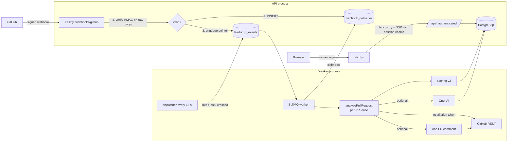

# PR Risk Scorer — Technical Reference

> What the system does, how every part works, the contracts it guarantees, how it is verified, and what changed in the repair of commit `6a7680b`.
> Setup and operations are in the [README](README.md). Figures below come from executed runs (see [§16](#16-verification-results)).

## Contents

1. [Overview](#1-overview)
2. [Stack](#2-stack)
3. [Repository layout and size](#3-repository-layout-and-size)
4. [Architecture](#4-architecture)
5. [Webhook intake and the durable inbox](#5-webhook-intake-and-the-durable-inbox)
6. [Delivery processing, retries and recovery](#6-delivery-processing-retries-and-recovery)
7. [Per-PR analysis: revisions, idempotency, concurrency](#7-per-pr-analysis-revisions-idempotency-concurrency)
8. [GitHub integration](#8-github-integration)
9. [Scoring contract v2](#9-scoring-contract-v2)
10. [AI review](#10-ai-review)
11. [PR comments](#11-pr-comments)
12. [Data model and migrations](#12-data-model-and-migrations)
13. [API, dashboard and statistics](#13-api-dashboard-and-statistics)
14. [Security model](#14-security-model)
15. [Testing strategy](#15-testing-strategy)
16. [Verification results](#16-verification-results)
17. [Demo data](#17-demo-data)
18. [Tunables](#18-tunables)
19. [Repair log: issues → fixes → verification](#19-repair-log-issues--fixes--verification)
20. [Known limitations and unverified live checks](#20-known-limitations-and-unverified-live-checks)

---

## 1. Overview

PR Risk Scorer is a single-workspace GitHub App plus dashboard. For each pull request revision in the configured installations it:

1. receives a signed webhook and stores it durably before acknowledging it,
2. fetches the PR, **all** listed changed files (paginated) and CI results for the exact head SHA,
3. computes a **deterministic 0–100 risk score** with reasons, every rule contribution and explicit uncertainties,
4. optionally (`AI_ENABLED`) asks an LLM for a structured review of up to three risky diffs,
5. optionally (`GITHUB_POST_COMMENTS`) maintains **one** app-owned PR comment,
6. shows results per revision in an authenticated dashboard.

Non-goals: public registration, multi-tenant SaaS, trained risk models, automatic fixes or merges. Code from PRs is never executed; diffs are only read as text.

## 2. Stack

| Layer | Choice (version) | Notes |
|---|---|---|
| Runtime / package manager | Node 24 LTS, pnpm 12.3.4 | pinned via `.nvmrc`, `engines`, `packageManager`, CI |
| API | Fastify 5.12, `fastify-raw-body` 5, `@fastify/cookie` 11, `fastify-plugin` 5 | Fastify 4 had unpatched advisories |
| Queue | BullMQ 5 on Redis 7 (`ioredis` 5) | one BullMQ attempt per enqueue; retries are durable in PostgreSQL |
| Database | PostgreSQL 16, Prisma 5.22 | append-only migrations |
| GitHub | `@octokit/rest` 20, `@octokit/auth-app` 6 | `authStrategy: createAppAuth` |
| AI | `openai` 4 (Chat Completions, JSON mode) | disabled by default |
| Validation | Zod 3 | config, requests, webhook payloads, AI output |
| Frontend | Next.js 15.5.26 (App Router), React 19, Tailwind 3 | request-time rendering only |
| Tests | Vitest 4.1, Testing Library, jsdom | real PostgreSQL/Redis for integration/e2e |
| Lint | ESLint 9 flat config, typescript-eslint 8.70, eslint-config-next 15 | zero warnings |

`pnpm audit`: **no known vulnerabilities** (after the upgrades and a `postcss` override for the copy pinned inside `next`). Prisma 5, Octokit 20/6 and openai 4 are older majors without published advisories; they were kept to avoid unrelated migrations.

## 3. Repository layout and size

```
backend/src
  server.ts / worker.ts     entry points (the only modules with side effects)
  app.ts                    Fastify app factory
  config/                   env.ts (typed, mode-aware), constants.ts
  http/                     error envelope, request ids, sessions + CSRF guards
  routes/                   health, webhooks, auth, prs (+stats), admin, demo
  webhooks/                 signature.ts, classify.ts, inbox.ts
  jobs/                     process-delivery.ts, dispatch.ts, runtime.ts
  analysis/                 analyze.ts, lease.ts, fingerprint.ts
  github/                   client.ts, retry.ts, pr-snapshot.ts, ci-status.ts, comments.ts
  scoring/                  rules.ts, paths.ts
  ai/                       file-selector, redaction, prompt-builder, client, validator, types
  api/pr-views.ts           view models + SQL aggregation
  auth/                     password (scrypt), sessions, login throttle
  demo/seed.ts, cli/        deterministic seed; hash-password, recover-deliveries, seed-demo, report-legacy-identity
backend/test                integration/, e2e/, helpers/ (mock GitHub/OpenAI, TCP toggle proxy), setup/
frontend/src                app/ (/, /login, /prs, /prs/[id], /stats, api/[...path] proxy), components/, lib/, __tests__/
```

| Metric | Value |
|---|---|
| Tracked files | 146 |
| TypeScript/JS lines | 10,266 |
| Backend source (non-test) | 4,873 lines |
| Backend tests (unit + integration + e2e + helpers) | 3,991 lines |
| Frontend source / tests | 1,072 / 261 lines |
| Prisma models / migrations | 8 / 4 |
| Automated tests | 337 (224 backend unit, 31 frontend, 74 integration, 8 e2e) |

## 4. Architecture



- The browser only talks to the dashboard origin. Next.js forwards `/api/*` to the API (`app/api/[...path]/route.ts`) and server components call the API with the user's session cookie and `cache: 'no-store'`. `API_INTERNAL_URL` is server-only.
- `pnpm dev` starts API, worker and dashboard; each can run alone. All modules except `server.ts`/`worker.ts` are side-effect free (factories take the typed config).
- Shutdown (`SIGTERM`/`SIGINT`): the API stops listening and drains; the worker stops the dispatcher, waits for active jobs, closes queue/Redis/Prisma. Forced exit after 15 s (API) / 60 s (worker).

## 5. Webhook intake and the durable inbox

`POST /webhooks/github` (`routes/webhooks.ts`), in order:

| Step | Failure |
|---|---|
| GitHub integration enabled | `503 GITHUB_DISABLED` |
| `fastify-raw-body` captured the exact bytes (`global:false`, route `config.rawBody:true`, `encoding:false`) | `500` |
| `X-Hub-Signature-256` = `sha256=` + HMAC-SHA256(secret, raw bytes), constant-time | `401` missing / malformed / invalid — nothing stored |
| `X-GitHub-Event`, `X-GitHub-Delivery` well-formed; `Content-Type: application/json` | `400` / `415` |
| JSON parses (the parser is lenient so bad signatures always get `401` first) | `400` |
| Classification + Zod validation (`webhooks/classify.ts`) | `400 INVALID_PAYLOAD` with field details |
| `ping` | `200`, no storage |
| unsupported event/action, other installation/repository, this App's own check suite | `202 {status:"ignored", reason}`, no storage, no job |
| `INSERT webhook_deliveries` (minimal payload: action, numbers, SHAs, repository identity — no bodies, titles, senders or diffs) | `503 STORAGE_UNAVAILABLE` (retryable; redeliver from GitHub) |
| enqueue `{deliveryId}` with job id `delivery__<id>__<attempt>` (bounded to 3 s) | still `202 {queued:false}` — the dispatcher enqueues later |
| same delivery id + same payload hash | `200 {status:"duplicate"}`; if it had **failed/died** it is reset and re-queued (`202 requeued`) |
| same delivery id, different payload | `409 DELIVERY_ID_CONFLICT` |

Validated per event: positive PR number equal to `pull_request.number`, installation id, repository id and `owner/name`, 40-hex head SHA, action within the handled set.

## 6. Delivery processing, retries and recovery

Delivery states: `received → queued → processing → succeeded | ignored | failed → … → dead`.

- **Claim**: a conditional `UPDATE … SET status='processing', attempts=attempts+1 WHERE status IN (received, queued, failed) OR (processing AND stale)`. Two jobs for one delivery can never run it concurrently.
- **Routing** (`jobs/process-delivery.ts`): `pull_request` → full analysis (`opened`, `synchronize`, `reopened`, `ready_for_review`, `edited` with base change) or metadata refresh (`edited`, `converted_to_draft`, `closed` incl. merge — no AI). `check_suite.completed` / `status` → full analysis of open PRs whose **current** head equals the SHA (otherwise `ignored`: obsolete head). `installation` (`deleted`/`suspend` → revoke, others → restore) and `installation_repositories` (`removed` → revoke, `added` → restore).
- **Outcome**: success → `succeeded`/`ignored`. `PermanentError` (403 permission, 404, invalid request, GitHub disabled) → `dead`. `RetryableError` → `failed` with `next_attempt_at` = GitHub reset/Retry-After time, or backoff 30 s·2ⁿ⁻¹ (≤ 30 min). After `DELIVERY_MAX_ATTEMPTS` (6) → `dead`. Waiting for another job's PR lease (`pr_locked`) does not consume an attempt.
- **Dispatcher** (worker, every 15 s): enqueues `received`, `failed` whose time has come, `queued` older than 5 min (lost job, e.g. Redis flushed), `processing` older than 10 min (crashed worker). A finished job with the same id is removed first so it can run again.
- **Retry layering**: GitHub calls retry in-process only for short waits (≤ 10 s rate limit, 2 transient retries); longer waits become a durable reschedule. BullMQ `attempts: 1`. The AI client has its own bounded policy (§10). Nothing multiplies retries across layers.

**Guarantees.** Acknowledged ⇒ durably stored. Processing is at-least-once; analysis results are idempotent (§7). External writes (comments) cannot be exactly-once; they are reconciled (§11).

**Recovery procedure** (also in the README):
1. GitHub never redelivers automatically. For outages where the API returned 5xx or was unreachable, redeliver from *App settings → Advanced → Recent Deliveries* (or `POST /app/hook/deliveries/{id}/attempts`). Redelivery is always safe.
2. Stored but failed/dead deliveries: `pnpm --filter backend deliveries:recover --list`, then `deliveries:recover [--include-dead] [--id <guid>]`, or `POST /api/admin/deliveries/recover`.
3. Redis outages need no action: stored deliveries are dispatched when Redis returns.

## 7. Per-PR analysis: revisions, idempotency, concurrency

`analysis/analyze.ts`:

1. **Lease**: `INSERT … ON CONFLICT DO UPDATE … WHERE expired` on `processing_leases`, keyed `<repo_github_id>:<number>` (TTL 5 min). Serialises all work on one PR across worker processes.
2. **Snapshot** (`github/pr-snapshot.ts`): PR → all files (paginated) → CI for that head → PR again; if the head moved, rebuild (≤ 3 times). Files, CI and metadata therefore belong to one revision.
3. **Conditional metadata write**: never overwrite a newer `github_updated_at`. A successful installation-scoped fetch re-activates the repository.
4. **Run identity**: `input_fingerprint` = SHA-256 of the scoring version, head SHA, base ref, counts, sorted per-file (name, status, additions, deletions), file-list completeness and CI status. `analysis_runs (pull_request_id, input_fingerprint)` and `pr_scores (pull_request_id, input_fingerprint)` are unique. Replays and retries create nothing; a CI change on the same SHA creates a new run (history); a new head creates a new run.
5. Unfinished enrichment of runs for older heads is marked `superseded`.
6. **AI stage**: only for the current head, at most 3 attempts per run; identical AI inputs reuse a stored result without a paid call. Outcomes: `pending | disabled | succeeded | unavailable | failed | superseded`. A failure never discards the score and sets the comment status to `skipped` (an older analysis is never published).
7. **Comment stage**: only this run's own analysis; the live head on GitHub is re-checked before publishing (`superseded` if it moved).

The API shows a score/analysis as *current* only when its `head_sha` equals the PR's head; others are labelled `previous_head` or `legacy_unknown`.

## 8. GitHub integration

- **Auth** (`github/client.ts`): `new Octokit({ authStrategy: createAppAuth, auth: { appId, privateKey, installationId }, baseUrl })`, cached per installation. Tokens are installation-scoped, cached by `@octokit/auth-app` for 59 minutes and re-requested afterwards (tested with a shifted clock). `\n`-escaped PEMs are accepted; `GITHUB_PRIVATE_KEY_PATH` is the alternative.
- **Files**: `octokit.paginate(pulls.listFiles, per_page 100)`. GitHub lists at most 3,000 files. If fewer files are listed than `changed_files`, coverage is stored as incomplete with a reason and shown as uncertainty. Files without a patch (binary/large) are counted. The same list feeds scoring and AI selection (no refetch).
- **CI** (`github/ci-status.ts`): Checks API (`filter=latest`, paginated, this App's own runs ignored) + combined commit status for the exact SHA, normalised to:

  | Status | When |
  |---|---|
  | `failure` | any check `failure`/`timed_out`/`action_required`/`startup_failure`, or status `failure`/`error` |
  | `pending` | otherwise any check not completed or status `pending` |
  | `success` | otherwise ≥ 1 success and the rest success/neutral/skipped, both sources readable |
  | `unknown` | no CI, only neutral/skipped, only cancelled/stale, or a source unreadable (missing permission) — with a reason |

- **Rate limits vs permissions** (`github/retry.ts`): 403/429 with `x-ratelimit-remaining: 0` (reset time), `Retry-After`, or a "rate limit" message → rate limit; other 403 → permission (permanent); 404 permanent; 5xx/network transient.
- **Permissions/events**: see the README (Metadata R, Pull requests R, Checks R, Commit statuses R, Issues RW only for comments; events Pull request, Check suite, Status).

## 9. Scoring contract v2

`scoring/rules.ts` (`SCORING_VERSION = 'v2'`). A higher threshold replaces the lower one within a rule.

| Rule | Points |
|---|---|
| Files changed | > 20 → +20, > 50 → +40 |
| Lines changed (additions + deletions) | > 500 → +20, > 1000 → +40 |
| Critical areas | 1 category → +20, ≥ 2 → +40 |
| No test file changed (and ≥ 1 file changed) | +20 |
| CI | `failure` → +20; `success` → 0; `pending`/`unknown` → 0 and listed under *uncertainties* |

Score = min(100, Σ); the raw sum is kept in `features.raw_score` (max 160). Levels: **LOW ≤ 30, MED ≤ 70, HIGH > 70** — the same function drives API levels, badges, folder statistics, seeds and docs. Possible scores: 0, 20, 40, 60, 80, 100. Reasons: top 3 by points, then fixed rule order (deterministic); all contributions are stored.

**Path conventions** (`scoring/paths.ts`, shared with AI selection). Matching uses whole path segments and filename tokens (split on separators and camelCase), never substrings:

| Category | Matches |
|---|---|
| Authentication | tokens auth, authentication, authn, authz, login, logout, session(s), oauth, sso, jwt, passport |
| Payments | payment(s), billing, invoice(s) |
| Configuration | config(s), configuration, settings; `.env*` |
| Infrastructure | infra(structure), deploy(ment/s), terraform, helm, k8s, kubernetes; `Dockerfile*`, `docker-compose*.yml`, `compose.yml` |
| Migrations | directories migrations/migration/migrate; `schema.prisma`, `schema.rb`, `structure.sql`, `schema.sql` |
| CI/CD workflows | `.github/workflows/`, `.github/actions/`, `.circleci/`, `.gitlab-ci.yml`, `.buildkite/` |

Test files: `*.test.*`, `*.spec.*`, `*_test.*`, `*_spec.*`, `test_*.py`, `*Test(s).java|kt|cs|swift`, or any directory named `test(s)`, `__tests__`, `spec(s)`, `e2e`, `integration-tests`. `author.ts`, `latest.ts`, `inspector.ts`, `contest/` and `specification.md` match nothing (tested). A file may belong to several categories (deduplicated across files); test files are never critical.

**Intentional changes from the legacy contract** (legacy scores keep `scoring_version='legacy'` and are not rewritten):
- CI is fetched; "unknown" no longer adds +20 to every PR. Only failure is penalised.
- Substring matching is replaced by segment/token conventions; "GitHub Actions" is renamed "CI/CD workflows" and anchored to CI directories.
- All applicable categories per file (was: first match only); test files are excluded from categories.
- The two legacy tests expecting > 70 for a lone size penalty were wrong: +40 size + 20 no-tests = 60 (MED). The tests now assert the arithmetic; thresholds are unchanged.
- A score is a review-prioritisation heuristic; a changed test file does not prove coverage.

## 10. AI review

Pipeline: select ≤ 3 files (`+200` critical bonus + churn, ties by name) → redact → build prompt → call → validate → store with limitations.

- **Redaction** (`ai/redaction.ts`): 13 detectors — PEM private keys (incl. unterminated), credential URLs, GitHub/Stripe/AWS/Google/Slack/OpenAI-style keys, JWTs, `Authorization` headers, `*key/*secret/*token = value` and `*password = value` assignments (env/template references excluded). Named groups mean the replacement never mistakes a match offset for a secret (the legacy bug). Applied to diffs, file names, reasons and uncertainties; counts are reported. Output detection uses non-global regex copies (stateless). **Limits**: pattern-based detection misses unrecognisable high-entropy strings, split or encoded secrets, and unusual formats.
- **Budgets** (`ai/prompt-builder.ts`): diffs ≤ 6,000 characters **including** truncation markers, allocated in ranking order (a file is *omitted* when fewer than 200 characters remain); file list ≤ 3,000 characters with an omitted count; reasons/uncertainties ≤ 10 × 300; whole user message ≤ 20,000 (worst case tested). Stored limitations: selected, truncated, omitted and missing-patch files, omitted file names, incomplete list, redaction count.
- **Untrusted data**: PR content sits inside `<untrusted_pr_data>` in the user message; the system message says it is data, never instructions, and that output is advisory text (no commands). Fence-closing text and control characters in PR content are neutralised.
- **Client** (`ai/client.ts`): SDK retries off; per-attempt `AbortController` deadline (`AI_TIMEOUT_MS`, default 20 s) with timers always cleared; ≤ 2 attempts, retrying only 429/5xx/connection/timeout (Retry-After ≤ 5 s, else 1 s); no retry for other 4xx, empty, non-JSON or invalid output. Failure kinds: `config`, `unavailable`, `invalid_output`.
- **Validation** (`ai/validator.ts`): summary 10–500; review_focus 3–5 × 5–200; test_suggestions 3–6 × 5–200; rollback_risk LOW|MED|HIGH; confidence finite 0–1 (model-reported, not calibrated); warnings ≤ 5 × 300; then a secret scan. A schema-valid answer can still be wrong.
- **Storage**: `pr_ai_analyses` with run, head SHA, model, prompt version (`v2`), input fingerprint and limitations; failures are recorded on the run (`ai_error`, sanitised).

## 11. PR comments

Off by default (`GITHUB_POST_COMMENTS`). One comment per PR, identified by `<!-- pr-risk-scorer:analysis -->` **and** `performed_via_github_app.id == GITHUB_APP_ID` (user comments containing the marker are never edited). Lookup: stored id → verify → else paginate all comments and pick ours. Update in place; create only if none exists. Creation is not retried in-process (it is not idempotent); if GitHub created the comment but the response was lost, the next attempt finds it by marker. The body names the analyzed SHA, score, CI status and uncertainties, neutralises `@mentions` and HTML comments in model text, and is published only for the current head and only from the current run's analysis.

## 12. Data model and migrations

Models: `Repo`, `PullRequest`, `PrScore`, `PrAiAnalysis`, `AnalysisRun`, `WebhookDelivery`, `ProcessingLease`, `AdminSession`.

Identity and timestamps: `pull_requests.number` (unique with `repo_id`), `github_id` (GitHub's PR id, unique, set only from GitHub data), legacy `github_pr_id` (nullable, not unique). `github_created_at`/`github_updated_at`/`closed_at`/`merged_at` are GitHub lifecycle times; `created_at` = first ingestion, `updated_at` = last local write. `repos.visibility` (NULL = unknown/legacy), `access_status`, `is_demo`.

Indexes: `repos(installation_id)`; `pull_requests(repo_id, number)` unique, `(repo_id, head_sha)`, `(updated_at, id)`; `pr_scores(pull_request_id, created_at, id)`; `pr_ai_analyses(pull_request_id, created_at, id)`; `analysis_runs(pull_request_id, created_at, id)`; `webhook_deliveries(status, next_attempt_at)`, `(received_at)`; `admin_sessions(expires_at)`; plus the uniqueness constraints above. Lists order by `(updated_at DESC, id DESC)`.

**Migration `20260929000000_pr_identity_revisions_inbox`** (additive; the three original migrations are untouched):
- backfills `number = github_pr_id` where it is a valid PR number (1…2³¹−1); otherwise `number` stays NULL and `identity_status = 'legacy_invalid_number'` (the value is preserved in `github_pr_id`);
- marks every pre-existing PR `legacy_unverified`; drops the incorrect global unique index; adds the `(repo_id, number)` unique index;
- existing scores: `scoring_version='legacy'`, `head_sha` NULL; existing AI analyses: `head_sha`/`run_id` NULL;
- keeps every row, UUID and foreign key.

**Legacy corruption that cannot be repaired.** Under the old schema, when two repositories had the same PR number, the second overwrote the first row's metadata and appended its scores/analyses to it; nothing recorded which repository each value came from. The migration does not guess. `pnpm --filter backend report:legacy-identity` lists every PR with legacy identity or legacy history and flags *potential* cross-repository collisions whenever more than one repository exists. When GitHub next reports such a PR, its current metadata is refreshed from GitHub (same UUID, `identity_status='verified'`), while its legacy history stays labelled `legacy_unknown`. The same-numbered PR from the other repository gets its own new row.

Upgrade steps for an existing database: back up → `pnpm --filter backend db:deploy` → `report:legacy-identity` → review the flagged rows. Verified by `test/integration/migration.test.ts` (§16).

## 13. API, dashboard and statistics

Endpoints are listed in [backend/README.md](backend/README.md). Every data endpoint requires a session; `/health`, `/ready` and `/api/version` are public; the webhook uses HMAC.

- PR list/detail include `number`, `github_id`, the deprecated alias `github_pr_id` (= `number`), repository visibility, draft/merged, GitHub and local timestamps, the preferred score with `revision_status`, CI status, coverage, uncertainties, all contributions, score history (current/previous/legacy labels), AI state (`status`, analyzed SHA, error, comment status, and the current analysis or a clearly labelled previous one), and `processing` while a delivery for the PR is unfinished. Legacy `{message}` reason objects are normalised to strings.
- **Statistics** are computed in PostgreSQL (no full-table load): each visible PR's latest score, preferring the current head; `average_score` over scored PRs only (`null` when there are none), with `unscored_prs` reported; level counts by the shared boundaries; top 10 folders = the first two **directory** components of each changed path (root files have none; a filename is never a folder), each PR counted once per folder.
- **Dashboard**: login page; list with CI/AI status pills, legacy/older-revision labels, previous/next pagination and accurate counts; detail with reasons, all contributions, an uncertainty box, and the AI panel (summary, review focus, suggested tests, rollback risk, model-reported confidence, warnings, limitations, analyzed SHA, timestamps, and explanations for the processing/disabled/failed/unavailable/missing/stale/superseded states); stats page; mobile menu (`<details>`, no JS). 401 → `/login?next=…` (open redirects rejected), 404 → not found, other errors show the status and request id without server details. Model text is rendered as plain text.

## 14. Security model

| Area | Control |
|---|---|
| Webhook authenticity | HMAC-SHA256 over raw bytes, full `sha256=` value, constant-time; rejected before storage |
| Dashboard auth | single admin; scrypt (N=2¹⁷, r=8, p=1) password hash from `auth:hash-password`; the example hash is rejected in production |
| Sessions | random 256-bit token, SHA-256 stored server-side; `HttpOnly`, `SameSite=Lax`, `Secure` in production; TTL; rotation on login; revocation on logout; expired/revoked sessions pruned |
| Brute force | Redis throttle: 5 failures per IP, 20 per username per 15 min; fails closed if Redis is down |
| CSRF | login and authenticated mutations require `Origin == FRONTEND_URL` and JSON bodies; SameSite cookies; no CORS grants |
| Authorization scope | only `WORKSPACE_INSTALLATION_IDS` (and optional `WORKSPACE_REPOSITORIES`) are processed or served, plus demo data; revoked repositories are hidden and not processed |
| Browser secrets | none: `NEXT_PUBLIC_DEMO_SECRET` removed; demo seeding requires an admin session, `DEMO_ENABLED` and non-production |
| Logs | request logs contain method, path (no query), request id and a header allowlist; redaction paths for authorization, cookies, signatures, passwords, keys, tokens, patches and payloads; stored errors are sanitised and truncated |
| Errors | 5xx responses never include messages or stacks |
| Infrastructure | Compose binds PostgreSQL/Redis to 127.0.0.1; production requires an https `FRONTEND_URL` |
| Supply chain | frozen lockfile; pnpm allow-list for build scripts; pnpm minimum release age respected; `pnpm audit` clean |

## 15. Testing strategy

| Tier | Where | What |
|---|---|---|
| Backend unit (224) | `backend/src/**/*.test.ts` | scoring boundaries/CI/paths/determinism; redaction positions, repeats, PEM, diffs, vendors, preservation of ordinary code; stateless validation; prompt budgets, fencing, redaction of all fields; AI client success, malformed JSON, schema, secrets, empty, 429 + Retry-After, 5xx, 401, real timeout abort; signatures (raw bytes, non-UTF-8, tampering); config modes; CI normalisation; GitHub error classification/retry; fingerprints; scrypt; comment formatting; network guard |
| Frontend (31) | `frontend/src/__tests__` | level boundaries, badge, pagination, AI panel states and stale labelling, inert model text, error states, login flow and messages, open-redirect guard, status-preserving API errors, proxy header/cookie forwarding and 502 |
| Integration (74) | `backend/test/integration` | HTTP API, auth/CSRF/throttle/rotation/expiry, workspace policy, every webhook intake path, Redis-down acceptance, DB-down 503; pipeline with mocked GitHub (JWT-verified, installation-scoped, paginated) and OpenAI: page-2 files, 3,000-file cap, same PR number in two repos, replays, CI change on the same SHA, new/out-of-order heads, moving head, AI failure with preserved score, close/merge metadata only, comment create/update/recreate/crash recovery/user comment untouched/stale head, missing Checks permission, rate-limit reset scheduling, installation isolation, token reuse/refresh, access removal, cross-process lease; crash boundaries A→E, retry budget, dead recovery, worker restart; upgrade migration and legacy API; stats and deterministic demo |
| End-to-end (8) | `backend/test/e2e/smoke.test.ts` | compiled `dist/server.js` + `dist/worker.js` + `next start`: invalid signature, unauthorized reads/redirect, signed webhook through the real queue and DB, AI + single comment, replay, CI change, same-number PR with AI failure, Redis outage via TCP proxy and recovery, worker graceful stop/restart, dashboard login and rendered score/history/stats/AI, logout, graceful API shutdown, no secrets in process logs |

Isolation: `docker-compose.test.yml` (tmpfs); database names must end in `_test`; loopback only outside CI; a network guard (`test/setup/network-guard.mjs`) makes every non-loopback TCP connection fail in the test process and in all processes the e2e test starts; `NEXT_TELEMETRY_DISABLED=1`. No paid AI calls, no GitHub writes.

## 16. Verification results

Fresh clone of branch `repair/full-stack-repair` (commit `7deb78a`), Node 24.21.0, pnpm 12.3.4, 2026-09-29:

| Command | Result |
|---|---|
| `pnpm install --frozen-lockfile` | exit 0 |
| `pnpm --filter backend db:generate` | exit 0 |
| `pnpm lint` | exit 0 (0 warnings) |
| `pnpm typecheck` | exit 0 |
| `pnpm test` | backend 224/224 (15 files), frontend 31/31 (4 files) |
| `pnpm --filter backend db:check` (shadow DB) | "No difference detected." exit 0 |
| `pnpm test:integration` | 74/74 (5 files), ~64 s; backend coverage during integration: statements 79.72 %, branches 71.70 %, functions 84.28 %, lines 81.99 % |
| `pnpm test:e2e` | 8/8 |
| `pnpm build` | backend `dist/`; frontend with every route dynamic (ƒ) while the backend was offline — exit 0 |
| `pnpm audit` | No known vulnerabilities found |
| `pnpm start` with the `.env.example` files | `/ready` 200 (database up, redis up), `/login` 200, unauthenticated `/prs` → 307 to login; SIGTERM → "Worker stopped", node exit 0 |

Unit-only backend coverage is 36.6 % of statements, because HTTP/database code is covered by the integration tier.

Baseline before the repair (same machine): `pnpm install --frozen-lockfile` → no lockfile; `pnpm install` → `ERR_PNPM_FETCH_404 @fastify/raw-body`. With that package swapped in a scratch copy: backend typecheck failed with TS6059 (rootDir), hiding 20 type errors; `eslint: not found`; `next lint` stopped at an interactive prompt; backend tests 49/54 passing; the frontend build succeeded but prerendered `/stats` statically.

## 17. Demo data

`pnpm --filter backend db:seed` or `POST /api/demo/seed` (admin session, `DEMO_ENABLED`, never production). Repositories `demo-acme/webapp|api|infrastructure` with reserved negative GitHub ids and `is_demo`; 11 PRs with fixed SHAs, timestamps and CI states; scores from the real engine, keyed by run fingerprint (repeat runs add nothing); two AI analyses are labelled fixtures (`model = "demo-fixture"`). Scenario file counts were corrected to match the listed files.

| PR | CI | Score | Level |
|---|---|---|---|
| Add unit tests for user service | success | 0 | low |
| Fix typo in README | success | 20 | low |
| Update dependencies | pending | 20 | low |
| Add loading spinner component | success | 0 | low |
| Refactor authentication middleware | success | 40 | medium |
| Add payment processing endpoint | failure | 40 | medium |
| Update CI/CD configuration | success | 60 | medium |
| Migrate database schema | unknown | 60 | medium |
| Add feature flags system | success | 20 | low |
| Major refactor: Rewrite authentication system | success | 100 | high |
| Implement payment gateway integration | pending | 100 | high |

Stats: 11 PRs, average **41.82**, low 5 / medium 4 / high 2. Folders: `src/auth` 100 (1 PR), `src/payments` 100 (1), `src/config` 65 (4), `.github/workflows` 60, `prisma` 60, `prisma/migrations` 60, `src/lib` 60, `src/models` 60 (1 each), `src/services` 52 (5), `src/types` 40 (2). All of these are asserted in `stats-demo.test.ts`.

## 18. Tunables

| Setting | Default | Where |
|---|---|---|
| Size/penalty/level thresholds | §9 | `scoring/rules.ts` |
| AI files / critical bonus | 3 / +200 | `ai/file-selector.ts` |
| Diff / file-list / prompt budget | 6,000 / 3,000 / 20,000 chars | `ai/prompt-builder.ts` |
| AI timeout / attempts | 20 s (`AI_TIMEOUT_MS`) / 2 per call, 3 per run | `ai/client.ts`, `analysis/analyze.ts` |
| GitHub inline wait / attempts | ≤ 10 s / 3 | `github/retry.ts` |
| Delivery attempts / backoff | 6 (`DELIVERY_MAX_ATTEMPTS`) / 30 s·2ⁿ⁻¹ ≤ 30 min | `jobs/process-delivery.ts` |
| Dispatcher interval / stale queued / stale processing | 15 s / 5 min / 10 min | `jobs/dispatch.ts` |
| Worker concurrency | 5 (`WORKER_CONCURRENCY`) | `worker.ts` |
| PR lease TTL | 5 min | `analysis/analyze.ts` |
| Session TTL / throttle | 12 h / 5 per IP, 20 per user per 15 min | `config/env.ts`, `auth/throttle.ts` |
| Webhook body limit / other bodies | 25 MB / 1 MB | `routes/webhooks.ts`, `app.ts` |
| Page size | 50 default API, 25 dashboard, max 100 | `routes/prs.ts`, `app/prs/page.tsx` |

## 19. Repair log: issues → fixes → verification

| # | Issue (source) | Fix | Verified by |
|---|---|---|---|
| 1 | `@fastify/raw-body` does not exist (audit) | `fastify-raw-body` 5 with Fastify 5 | frozen install, e2e |
| 2 | No lockfile; stray untracked npm `package-lock.json` (audit) | committed `pnpm-lock.yaml`, removed the npm lockfile, other lockfiles ignored | CI `--frozen-lockfile`, clean clone |
| 3 | Unpinned Node/pnpm; pnpm ≥ 10 blocks build scripts (found) | Node 24 LTS + pnpm 12.3.4 pinned everywhere; `allowBuilds` | clean clone |
| 4 | Vulnerable Fastify 4, Next 14, Vitest ≤ 3, postcss (found by audit) | Fastify 5.12, Next 15.5.26, Vitest 4.1.11, postcss override | `pnpm audit` clean |
| 5 | No ESLint dependency/config; `next lint` interactive (audit) | ESLint 9 flat configs, `--max-warnings 0` | `pnpm lint` |
| 6 | Backend `rootDir` vs prisma/scripts; a route imported a script outside `src` (found) | `tsconfig.json` (check all) + `tsconfig.build.json` (emit `src`); seed moved to `src/demo` | build, `dist/server.js`/`worker.js`, version lookup |
| 7 | 20 hidden type errors (request-context misuse, nullable patch, null destructure, JSON types, validation typings) (found) | modules rewritten; request-context removed in favour of `request.id` | `pnpm typecheck` |
| 8 | Next route param types (audit) | Next 15 async `params`/`searchParams` | typecheck, e2e |
| 9 | Importing modules started connections/listeners (found) | factories + entry points only | unit tests import freely |
| 10 | Fastify encapsulation: error handler/request id not applied to siblings (found) | root plugins via `fastify-plugin` | API tests (404/validation envelopes, headers) |
| 11 | No typed config; env read at import (found) | `config/env.ts` modes with complete error lists; blank = unset | `env.test.ts`, dev run |
| 12 | `pnpm dev` omitted the worker (audit) | root `dev` runs API + worker + web | dev run |
| 13 | No graceful shutdown/readiness (found) | SIGTERM handling; `/ready` | e2e (exit 0, `/ready` 503/200) |
| 14 | Webhook signature never awaited → bypass (audit) | constant-time HMAC over raw bytes, full header | unit + API tests + e2e |
| 15 | Raw body would be undefined with `global:false` (audit) | route `config.rawBody:true` | API tests |
| 16 | Weak payload validation (found) | Zod per event; 400 with details | API tests |
| 17 | Lost deliveries when enqueue fails; 200 always (audit) | durable inbox, 202 after commit, 503 if not stored, dispatcher | API and recovery tests, e2e Redis outage |
| 18 | No dedupe/conflict detection; failed work lost after cleanup (found) | payload hash, requeue of failed/dead replays, attempt-scoped job ids | API + recovery tests |
| 19 | Only opened/synchronize handled; merges/closes never updated (audit) | all lifecycle actions; metadata-only for close/draft | pipeline tests |
| 20 | No installation/access removal handling (found) | revoke/restore + visibility policy | pipeline + API tests |
| 21 | Incorrect Octokit App auth usage (found) | `authStrategy: createAppAuth` + `auth` | mock server verifies the JWT; token tests |
| 22 | New auth flow per call (audit) | per-installation client cache | token reuse test |
| 23 | Files not paginated (30 max) and fetched three times (audit) | paginate once and reuse; 3,000-cap detection | page-2 and 3,000-file tests |
| 24 | CI hard-coded "unknown" (+20 for every PR) (audit) | Checks + statuses for the exact SHA, normalised | CI unit tests, pipeline, e2e |
| 25 | Any 403 treated as a rate limit (audit) | classifier; reset/Retry-After; bounded | retry unit tests, reset scheduling test |
| 26 | PR number stored as a globally unique id (audit) | `(repo_id, number)`, `github_id`, additive migration | migration + two-repo tests |
| 27 | `private` always false (audit) | real visibility from GitHub | pipeline test |
| 28 | No revision on scores/AI; duplicates on every event (found) | runs + fingerprints + head SHA; legacy labelled | replay/CI/new-head tests |
| 29 | Concurrent/out-of-order jobs could overwrite state (found) | DB lease, conditional writes, head revalidation, supersede | concurrency, moving-head, out-of-order tests |
| 30 | Comment reposted on every push; could post stale/historical analysis (audit) | one comment, marker + authorship, current run only, head recheck, crash reconcile | comment tests |
| 31 | 5 failing tests (audit): 2 wrong huge-PR expectations; redaction offset bug (2); unrealistic secret fixture | tests corrected to the arithmetic; redaction fixed; realistic runtime-built fixtures | unit tests |
| 32 | Stateful `/g` regex `.test()` in the validator (audit) | non-global copies | repeated-call tests |
| 33 | Substring path/test matching (audit) | segment/token conventions | `paths.test.ts` |
| 34 | Uncancelled `Promise.race` timeout, stacked retries (found) | AbortController deadline, SDK retries off, one policy | client timeout test |
| 35 | Diff budget ignored markers; no overall prompt bound; PR text not fenced (found) | enforced budgets, limitations report, fencing | prompt tests |
| 36 | Unauthenticated read API (audit) | admin login, sessions, throttling, CSRF | API tests, e2e |
| 37 | `NEXT_PUBLIC_DEMO_SECRET` exposed; demo secret compared with `!==` (audit) | removed; session-authorised demo endpoint | API tests |
| 38 | Headers (incl. secrets) logged in production (audit) | allowlisted serializers + redaction; sanitised stored errors | e2e log scan |
| 39 | Dashboard never showed the AI analysis (audit) | full AI state contract and panel | frontend + e2e |
| 40 | Stale/static rendering; `/stats` prerendered at build (audit, reproduced) | per-request rendering, `no-store` | build output, e2e |
| 41 | Error handling by message substrings (found) | `ApiError` with status; 401/403/404/5xx handling | frontend tests |
| 42 | No pagination controls; "Updated" showed the creation time; no mobile nav (audit) | prev/next, GitHub updated time, mobile menu | frontend tests |
| 43 | Folder stats treated `schema.prisma` as a folder; loaded all PRs into memory (audit) | directory components, SQL aggregation, current-head preference | stats tests |
| 44 | Two seed paths with different shapes; duplicate history on reseed; 10 vs 11 PRs (audit) | one deterministic, idempotent seed with 11 documented PRs; legacy object reasons normalised | demo + migration tests |
| 45 | CI: setup-node cache before pnpm; no services (audit) | single `ci.yml`, correct order, services, all tiers | workflow definition (see §20) |
| 46 | Docs drift: env names, missing `.env.example`, badges, counts (audit) | README, backend README, `.env.example` files, this document | example env test |
| 47 | Dead code and duplicated retry helpers (audit) | removed; one GitHub retry module | lint/typecheck |
| 48 | `.gitignore` ignored `.dockerignore`, duplicate `*.pem` (audit) | fixed | — |
| 49 | Dev DB/Redis ports exposed on all interfaces (found) | bound to 127.0.0.1 | compose file |
| 50 | `enableOfflineQueue:false` + DB index in `REDIS_URL` → unhandled rejection (found in testing) | bounded offline queue + call-site timeouts | API tests (no unhandled errors) |
| 51 | `safeNext` exported from a client module and called on the server (found by e2e) | shared module | e2e |
| 52 | Fastify `requestIdLogLabel` deprecation (found) | option removed (default `reqId` log label) | dev log clean |
| 53 | pnpm does not forward SIGTERM to its children (found) | production docs run `node dist/*.js` directly | manual check |

## 20. Known limitations and unverified live checks

Verified only against mocks (confirming these needs real credentials or infrastructure):
- A real GitHub App installation: the JWT/installation-token exchange against api.github.com, real webhook deliveries and signatures from GitHub, actual permission errors, real rate-limit headers, the 3,000-file limit, Checks/Statuses shapes from real CI providers, and comment authorship fields on github.com / GitHub Enterprise.
- Real OpenAI responses and model behaviour for the configured `AI_MODEL`.
- The GitHub Actions workflow itself has not run on GitHub; its commands were executed locally, in the same order, against equivalent containers.

Design limits:
- Pattern-based redaction cannot catch every secret (§10).
- CI status reflects what the Checks/Statuses APIs show when the snapshot is taken; later CI changes arrive via `check_suite`/`status` events.
- The combined commit status reads the first 100 contexts.
- The lease TTL (5 min) bounds one PR's processing; extremely slow GitHub responses could let a second job take over after expiry (results remain idempotent).
- A single admin account by design; no roles and no audit trail of dashboard views.
- Legacy rows from before the migration may contain another repository's history; it is labelled and reported, not repaired (§12).
